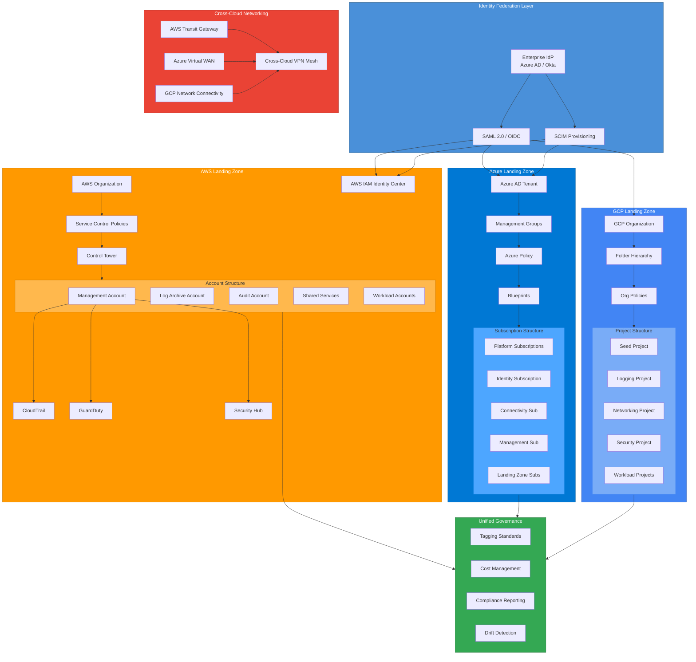

# Multi-Cloud Landing Zone

A comprehensive, production-ready multi-cloud landing zone reference architecture spanning AWS, Azure, and GCP. This project provides Terraform modules that establish secure, compliant, and well-governed cloud foundations with unified identity federation across all three major cloud providers.

## Architecture Overview



## Project Structure

```
multi-cloud-landing-zone/
├── modules/
│   ├── aws-landing-zone/      # AWS Organization, SCPs, Control Tower
│   │   ├── main.tf
│   │   ├── variables.tf
│   │   └── outputs.tf
│   ├── azure-landing-zone/    # Management Groups, Policy, Blueprints
│   │   ├── main.tf
│   │   ├── variables.tf
│   │   └── outputs.tf
│   ├── gcp-landing-zone/      # Organization, Folders, Org Policies
│   │   ├── main.tf
│   │   ├── variables.tf
│   │   └── outputs.tf
│   └── identity-federation/   # Cross-cloud SSO and RBAC
│       ├── main.tf
│       ├── variables.tf
│       └── outputs.tf
├── LICENSE
├── CHANGELOG.md
└── README.md
```

## Features

- **AWS Landing Zone**: Automated multi-account setup with AWS Organizations, Service Control Policies, and Control Tower guardrails
- **Azure Landing Zone**: Enterprise-scale architecture with Management Groups, Azure Policy, and Blueprints aligned to CAF
- **GCP Landing Zone**: Organization hierarchy with Folders, Org Policies, and project factory pattern
- **Identity Federation**: Centralized identity with SAML 2.0/OIDC federation and SCIM provisioning across all clouds
- **Unified Governance**: Consistent tagging, cost management, compliance reporting, and drift detection
- **Cross-Cloud Networking**: VPN mesh connectivity between AWS Transit Gateway, Azure Virtual WAN, and GCP Network Connectivity Center

## Usage

```hcl
module "aws_landing_zone" {
  source = "./modules/aws-landing-zone"

  organization_name     = "my-org"
  enable_control_tower  = true
  enable_guardduty      = true
  enable_security_hub   = true
  allowed_regions       = ["us-east-1", "eu-west-1"]
}

module "azure_landing_zone" {
  source = "./modules/azure-landing-zone"

  root_management_group_name = "my-org"
  enable_defender            = true
  allowed_locations          = ["eastus", "westeurope"]
}

module "gcp_landing_zone" {
  source = "./modules/gcp-landing-zone"

  org_id          = "123456789"
  billing_account = "XXXXXX-XXXXXX-XXXXXX"
  allowed_regions = ["us-central1", "europe-west1"]
}

module "identity_federation" {
  source = "./modules/identity-federation"

  idp_metadata_url = "https://login.microsoftonline.com/.../metadata"
  aws_sso_arn      = module.aws_landing_zone.sso_instance_arn
  gcp_org_id       = module.gcp_landing_zone.org_id
}
```

## License

This project is licensed under the MIT License - see the [LICENSE](LICENSE) file for details.
